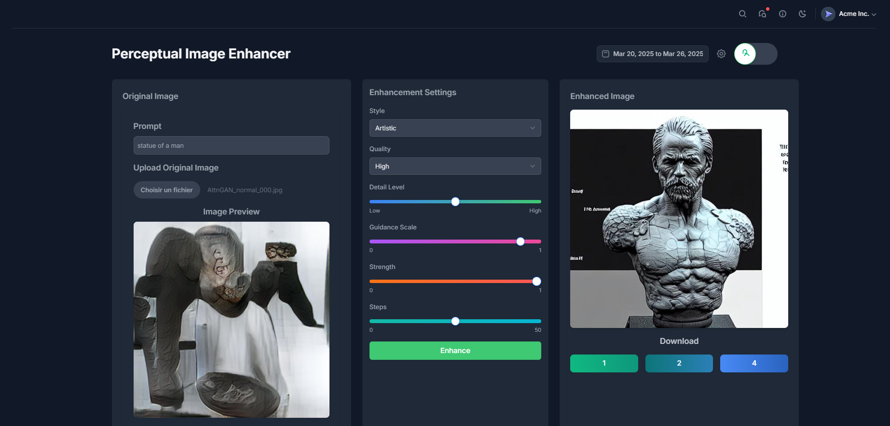
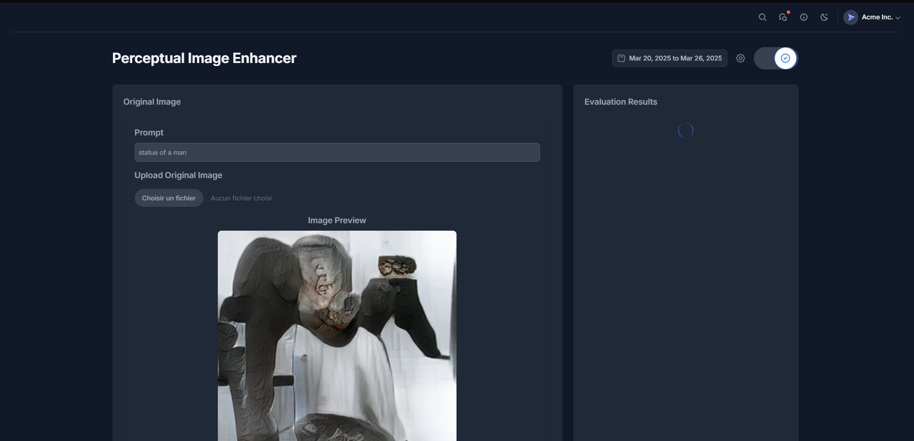
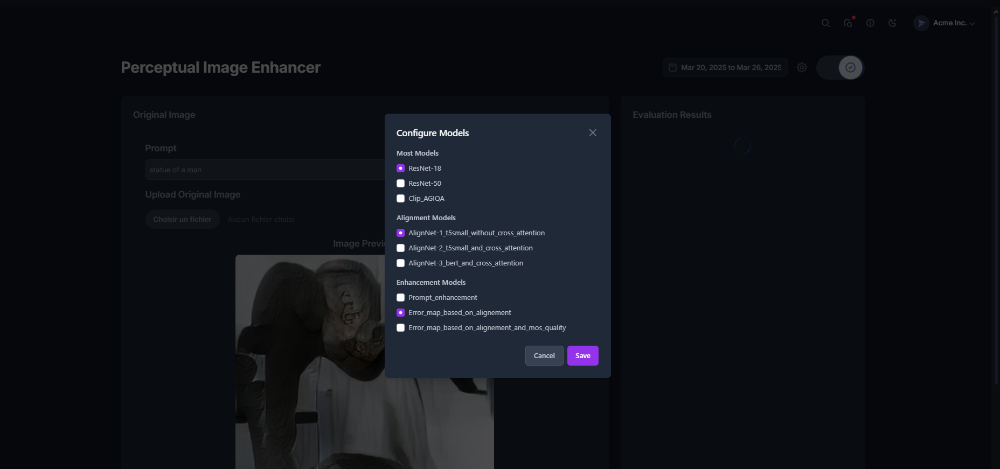

# Perceptual Image Enhancer

This project evaluates and enhances generated images using advanced AI techniques, such as fine-tuning text models for prompt enhancement and detecting error regions with Vision Transformers (ViT).

 *(Add a real screenshot)*

## Features
- **Image Enhancement**:
  - Utilizes Stable Diffusion with customizable parameters (`prompt`, `steps`, `strength`, etc.).
  - Includes inpainting modes to fill detected error regions.
- **Quality Evaluation**:
  - MOS (Mean Opinion Score) using ResNet-18/50.
  - Alignment score using AlignNet with T5/BERT models.
    
- **Dynamic Interface**:
  - Light/Dark theme support.
  - Smooth gradient loading animations.
  - Download buttons for enhanced images (1K, 2K, 4K resolutions).
- **Customizable Models**:
  - Choice of perceptual, alignment, and enhancement models.
    

## Tech Stack
- **Backend**: Django + Django REST Framework
- **Frontend**: React + Tailwind CSS
- **AI/ML**:
  - PyTorch
  - Stable Diffusion (image generation and inpainting)
  - ResNet (quality assessment)
  - T5/BERT models for alignment
  - Vision Transformer (ViT)

## Installation

### Backend (Django)
```bash
# Create a virtual environment
python -m venv venv
source venv/bin/activate  # Windows: venv\Scripts\activate

# Install dependencies
pip install -r requirements.txt

# Apply database migrations
python manage.py migrate

# Start the development server
python manage.py runserver
